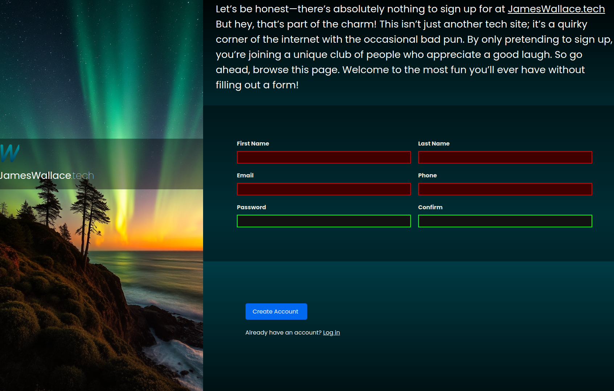

# Sign-Up Form


This repository contains a responsive sign-up form built with HTML, CSS, and JavaScript. The form features client-side validation using HTML5 and JavaScript, along with responsive design adjustments using CSS media queries.



## Features

- **Responsive Design**: The form layout adjusts for various screen sizes, making it user-friendly on both desktop and mobile devices.
- **Client-Side Validation**: Utilizes HTML5 validation features to ensure that all required fields are filled in correctly before submission.
- **Custom Styles**: The form is styled with custom fonts, buttons, and color schemes, providing a modern and clean user interface.
- **Interactive Feedback**: Invalid fields are highlighted with custom styles and icons, giving users immediate feedback.

## Demo

You can view the live demo of this sign-up form on [GitHub Pages](https://opuslearning.github.io/Sign-up/).

## Installation

To run this project locally, follow these steps:

1. Clone the repository:
    ```bash
    git clone https://github.com/opuslearning/Sign-up.git
    ```

2. Navigate to the project directory:
    ```bash
    cd Sign-up
    ```

3. Open `index.html` in your preferred web browser:
    ```bash
    open index.html
    ```

## Usage

- **Sign Up**: Fill in the form fields with your information. Fields include First Name, Last Name, Email, Phone, Password, and Confirm Password.
- **Form Validation**: If any fields are invalid, the form will not submit, and error messages will be displayed.
- **Responsive Layout**: Resize your browser window to see how the form adjusts to different screen sizes.

## Technologies Used

- **HTML5**: Structure of the sign-up form.
- **CSS3**: Styling for the form, including Flexbox and media queries for responsiveness.
- **JavaScript**: Handling form submission and additional validation.


## Contact

If you have any questions

- **GitHub**: [opuslearning](https://github.com/opuslearning)

